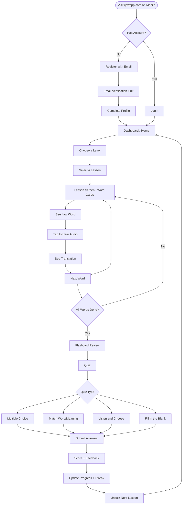
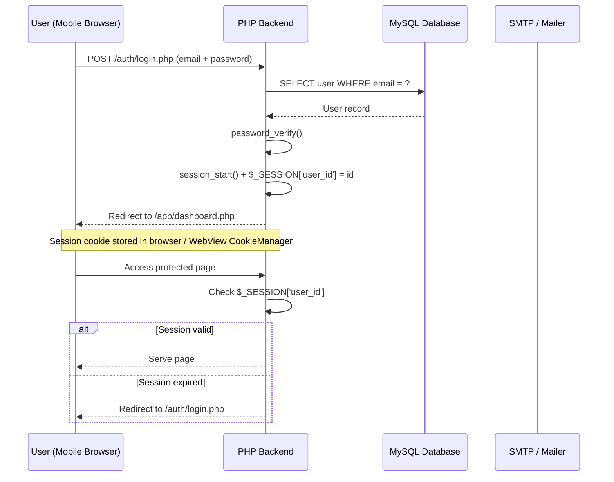
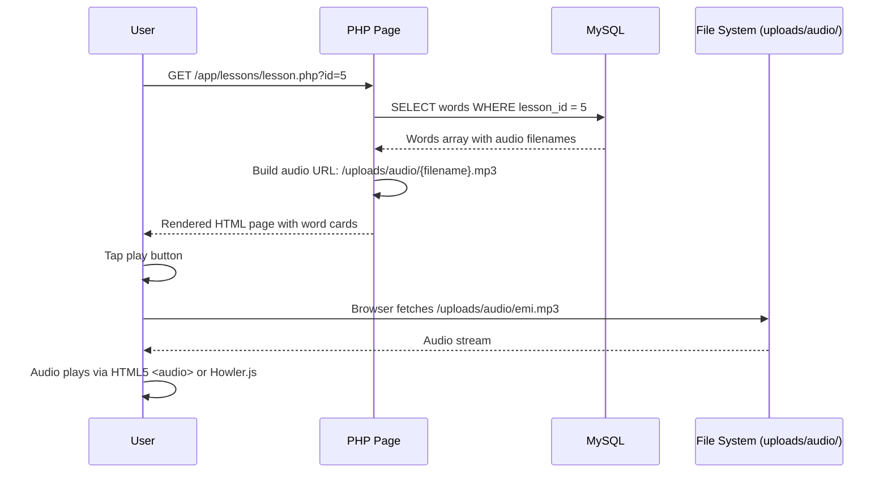
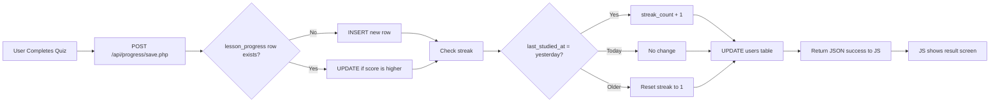
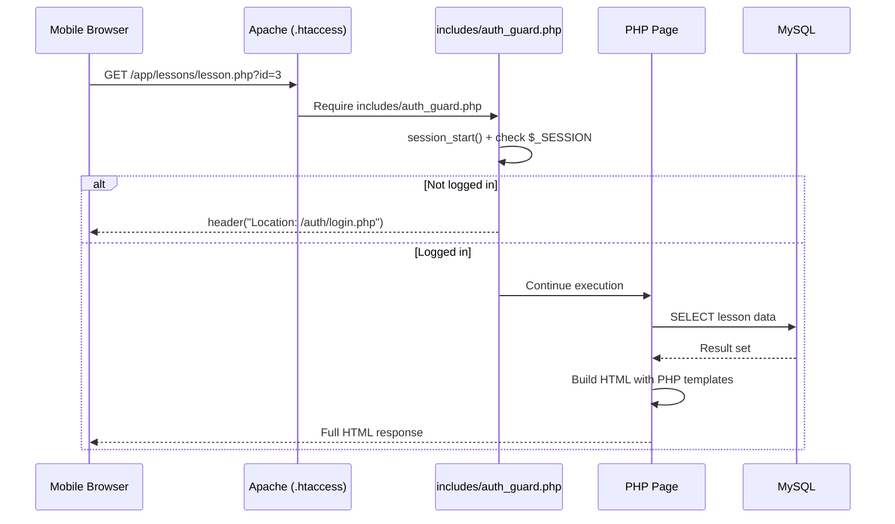
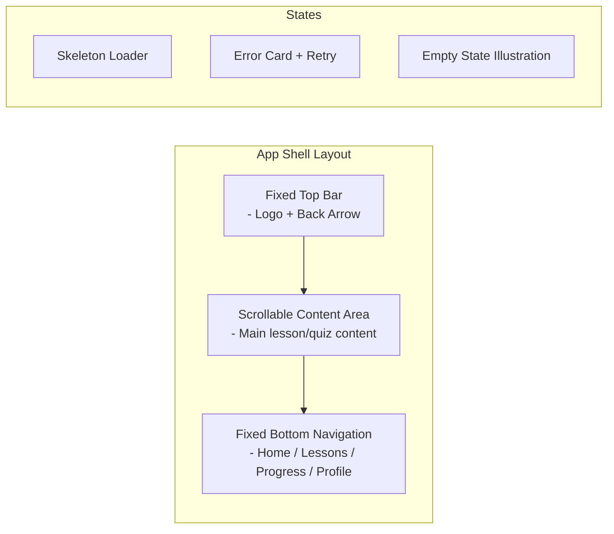
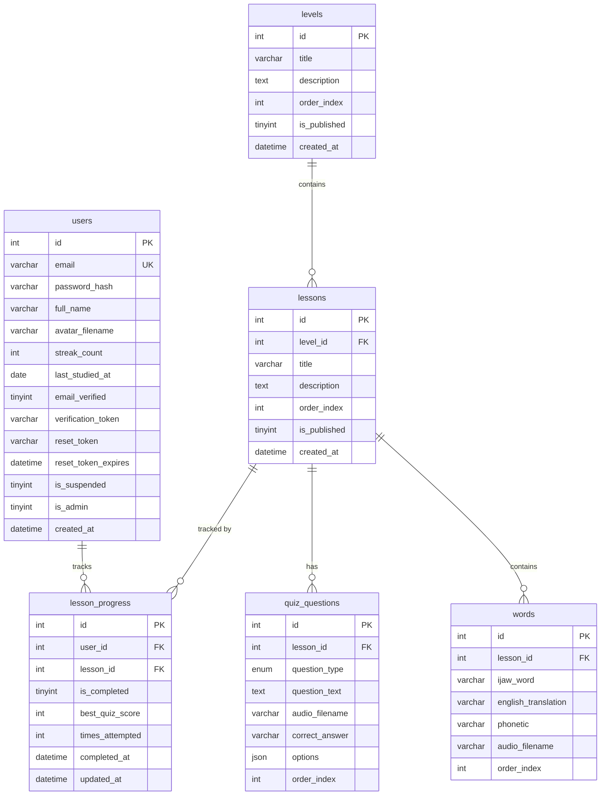
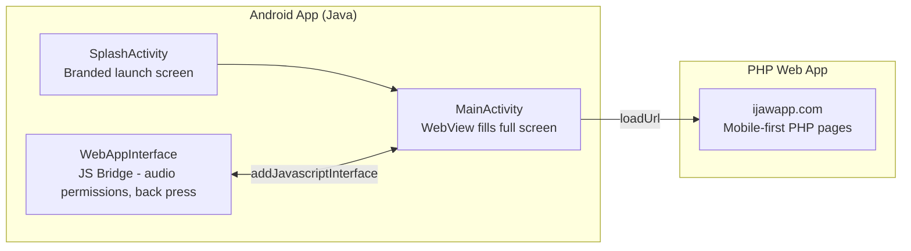

# Ijaw Language Learning App — PHP Web App (Mobile-First)

> A mobile-first PHP/MySQL web application for learning the Ijaw language, hosted on Namecheap shared hosting. The web app is designed to be fully functional in the browser on mobile devices, and can be wrapped into a native Android/iOS app using a Java WebView (Android) or WKWebView (iOS) and published to the Play Store and App Store.

---

## Table of Contents

1. [Project Overview](#project-overview)
2. [How the App Works](#how-the-app-works)
3. [Architecture](#architecture)
4. [Tech Stack](#tech-stack)
5. [File Structure](#file-structure)
6. [Database Schema](#database-schema)
7. [Key Features Explained](#key-features-explained)
8. [Admin Dashboard](#admin-dashboard)
9. [Converting to Android/iOS App](#converting-to-androidios-app)
10. [Setup on Namecheap Shared Hosting](#setup-on-namecheap-shared-hosting)
11. [Environment Configuration](#environment-configuration)

---

## Project Overview

This version of the Ijaw Language Learning App is built as a **mobile-first progressive web application** using PHP and MySQL. It runs entirely on shared hosting with no Node.js or Docker required.

The strategy is:

1. Build a responsive, app-like web experience accessible at `ijawapp.com` from any phone browser
2. Wrap that web app in a native Android shell using Java/Kotlin + WebView and publish it to the Google Play Store
3. Do the same for iOS using a Swift/Objective-C WKWebView wrapper for the App Store
4. The PHP backend handles all logic — authentication, lesson delivery, progress tracking, audio file management, and admin content management

Phase 1 covers the Kolokuma dialect. Additional dialects are added via the admin panel without any code changes.

---

## How the App Works

### User Journey



### Authentication Flow



### Lesson Delivery Flow



### Progress Tracking Flow



---

## Architecture

### System Architecture

```mermaid
graph TB
    subgraph Client["Mobile Browser / WebView"]
        HTML[HTML5 Pages]
        JS[Vanilla JS / Alpine.js]
        CSS[Tailwind CSS]
        Audio[HTML5 Audio API]
        SW[Service Worker\nOffline Cache]
    end

    subgraph Server["Namecheap Shared Hosting (cPanel)"]
        PHP[PHP 8.x]
        Apache[Apache + .htaccess]
        Session[PHP Sessions]
        Cron[Cron Jobs]
    end

    subgraph DB["Database"]
        MySQL[(MySQL Database)]
    end

    subgraph Storage["File Storage"]
        Uploads[/uploads/audio/\n/uploads/images/]
    end

    subgraph Admin["Admin Panel"]
        AdminPHP[/admin/ PHP pages]
    end

    HTML --> JS
    JS -->|AJAX fetch()| PHP
    PHP --> MySQL
    PHP --> Uploads
    AdminPHP --> MySQL
    AdminPHP --> Uploads
    SW --> HTML
    SW --> Uploads
    Apache --> PHP
    Cron --> PHP
```

### Page Request Lifecycle



### Mobile-First UI Pattern



---

## Tech Stack

| Layer | Technology |
|---|---|
| Language | PHP 8.x |
| Database | MySQL 8.x |
| Hosting | Namecheap Shared Hosting (cPanel) |
| CSS Framework | Tailwind CSS (CDN) |
| Icons | Bootstrap Icons |
| JavaScript | Alpine.js + Vanilla JS |
| Audio | HTML5 Audio API + Howler.js |
| AJAX | Fetch API (JSON endpoints) |
| Sessions | PHP native sessions |
| Email | PHPMailer + SMTP |
| Offline Support | Service Worker (PWA) |
| Android Wrapper | Java + WebView (Android Studio) |
| iOS Wrapper | Swift + WKWebView (Xcode) |
| Admin | PHP admin pages (same codebase) |

---

## File Structure

```
ijawapp.com/                                 # Root directory (public_html on Namecheap)
│
├── 📄 index.php                             # Landing page / redirect to dashboard or login
├── 📄 .htaccess                             # Apache rewrite rules + security headers
├── 📄 robots.txt
├── 📄 sitemap.xml
├── 📄 manifest.json                         # PWA web app manifest
├── 📄 sw.js                                 # Service worker for offline caching
├── 📄 favicon.ico
├── 📄 README.md
│
├── 📁 includes/                             # Shared PHP includes (never directly accessible)
│   ├── 📄 config.php                        # DB credentials, site URL, constants
│   ├── 📄 db.php                            # PDO connection singleton
│   ├── 📄 auth_guard.php                    # Session check - redirects if not logged in
│   ├── 📄 admin_guard.php                   # Admin session check
│   ├── 📄 functions.php                     # General utility functions
│   ├── 📄 audio_functions.php               # Audio upload + URL helper functions
│   ├── 📄 progress_functions.php            # Streak and progress calculation
│   ├── 📄 mail.php                          # PHPMailer setup
│   ├── 📄 validation.php                    # Input sanitisation and validation
│   ├── 📄 pagination.php                    # Pagination helper
│   ├── 📄 header.php                        # Global HTML head + top bar
│   ├── 📄 footer.php                        # Global footer + bottom nav
│   └── 📄 flash.php                         # Flash message helper (success/error toasts)
│
├── 📁 auth/                                 # Authentication pages
│   ├── 📄 login.php                         # Login form
│   ├── 📄 register.php                      # Registration form
│   ├── 📄 logout.php                        # Destroy session + redirect
│   ├── 📄 forgot_password.php               # Request reset link
│   ├── 📄 reset_password.php                # Set new password via token
│   └── 📄 verify_email.php                  # Verify email from token link
│
├── 📁 app/                                  # Main app pages (protected)
│   │
│   ├── 📄 dashboard.php                     # Home screen - streak, progress summary, recent lessons
│   │
│   ├── 📁 levels/
│   │   ├── 📄 index.php                     # All levels overview (Level 1, 2, 3)
│   │   └── 📄 view.php                      # Single level - lesson list (?id=1)
│   │
│   ├── 📁 lessons/
│   │   ├── 📄 lesson.php                    # Main lesson screen - word cards + audio (?id=5)
│   │   ├── 📄 complete.php                  # Lesson complete summary screen
│   │   └── 📄 downloaded.php               # Downloaded (offline) lessons list
│   │
│   ├── 📁 flashcards/
│   │   ├── 📄 deck.php                      # Select flashcard deck (?lesson_id=5)
│   │   └── 📄 review.php                    # Flip card review session
│   │
│   ├── 📁 quiz/
│   │   ├── 📄 start.php                     # Quiz intro screen (?lesson_id=5)
│   │   ├── 📄 question.php                  # Renders single question (AJAX-driven)
│   │   └── 📄 result.php                    # Quiz result screen
│   │
│   ├── 📁 progress/
│   │   ├── 📄 index.php                     # Full progress overview
│   │   └── 📄 achievements.php             # Badges and achievements
│   │
│   └── 📁 profile/
│       ├── 📄 view.php                      # User profile page
│       ├── 📄 edit.php                      # Edit display name, avatar
│       ├── 📄 change_password.php
│       └── 📄 settings.php                  # Notifications, language prefs
│
├── 📁 api/                                  # JSON API endpoints (called via fetch() from JS)
│   │
│   ├── 📁 auth/
│   │   ├── 📄 login.php                     # POST - returns JSON + sets session
│   │   ├── 📄 register.php                  # POST - create user
│   │   └── 📄 check_session.php             # GET - returns current user JSON
│   │
│   ├── 📁 lessons/
│   │   ├── 📄 get_words.php                 # GET ?lesson_id=5 - word list with audio URLs
│   │   ├── 📄 get_flashcards.php            # GET ?lesson_id=5
│   │   └── 📄 get_quiz.php                  # GET ?lesson_id=5 - quiz questions JSON
│   │
│   ├── 📁 progress/
│   │   ├── 📄 save.php                      # POST - save quiz score + mark lesson complete
│   │   ├── 📄 get_user_progress.php         # GET - full progress for current user
│   │   └── 📄 get_streak.php               # GET - streak data
│   │
│   ├── 📁 user/
│   │   ├── 📄 update_profile.php            # POST - update display name / avatar
│   │   └── 📄 upload_avatar.php             # POST - upload profile image
│   │
│   └── 📁 offline/
│       ├── 📄 download_lesson.php           # GET - full lesson JSON for offline storage
│       └── 📄 sync_progress.php             # POST - sync offline progress queue
│
├── 📁 admin/                                # Admin portal
│   │
│   ├── 📄 index.php                         # Admin login page
│   ├── 📄 logout.php
│   ├── 📄 dashboard.php                     # Admin home - stats + recent activity
│   │
│   ├── 📁 includes/
│   │   ├── 📄 admin_header.php
│   │   ├── 📄 admin_sidebar.php
│   │   └── 📄 admin_footer.php
│   │
│   ├── 📁 levels/
│   │   ├── 📄 index.php                     # List all levels
│   │   ├── 📄 create.php                    # Create new level
│   │   └── 📄 edit.php                      # Edit level (?id=1)
│   │
│   ├── 📁 lessons/
│   │   ├── 📄 index.php                     # List all lessons
│   │   ├── 📄 create.php                    # Create new lesson
│   │   ├── 📄 edit.php                      # Edit lesson
│   │   └── 📄 reorder.php                   # Drag to reorder lessons (AJAX)
│   │
│   ├── 📁 words/
│   │   ├── 📄 index.php                     # List words in a lesson
│   │   ├── 📄 create.php                    # Add word + upload audio
│   │   ├── 📄 edit.php                      # Edit word/translation/audio
│   │   └── 📄 delete.php                    # Delete word (POST)
│   │
│   ├── 📁 quizzes/
│   │   ├── 📄 index.php                     # List quiz questions for a lesson
│   │   ├── 📄 create.php                    # Build new question
│   │   ├── 📄 edit.php                      # Edit question
│   │   └── 📄 delete.php
│   │
│   ├── 📁 users/
│   │   ├── 📄 index.php                     # All users table
│   │   ├── 📄 view.php                      # User detail + progress (?id=123)
│   │   └── 📄 suspend.php                   # Suspend / reactivate user
│   │
│   └── 📁 settings/
│       ├── 📄 general.php                   # Site name, contact email, etc.
│       └── 📄 email.php                     # SMTP configuration
│
├── 📁 assets/                               # Static assets
│   │
│   ├── 📁 css/
│   │   ├── 📄 app.css                       # Custom styles (Tailwind overrides + app shell)
│   │   ├── 📄 lesson.css                    # Lesson + word card styles
│   │   ├── 📄 quiz.css                      # Quiz screen styles
│   │   ├── 📄 flashcard.css                 # Flip card animation
│   │   └── 📄 admin.css                     # Admin panel styles
│   │
│   ├── 📁 js/
│   │   ├── 📄 app.js                        # Global JS init + Alpine.js data
│   │   ├── 📄 audio.js                      # Howler.js audio player wrapper
│   │   ├── 📄 lesson.js                     # Word card swipe / navigation
│   │   ├── 📄 flashcard.js                  # Flip card logic
│   │   ├── 📄 quiz.js                       # Quiz state machine (question flow)
│   │   ├── 📄 progress.js                   # Progress charts (Chart.js)
│   │   ├── 📄 offline.js                    # Service worker registration + offline queue
│   │   └── 📄 admin.js                      # Admin panel interactivity
│   │
│   ├── 📁 images/
│   │   ├── 🖼️ logo.png
│   │   ├── 🖼️ logo-white.png
│   │   ├── 🖼️ app-icon-192.png              # PWA icon
│   │   ├── 🖼️ app-icon-512.png              # PWA icon
│   │   ├── 🖼️ splash.png                    # PWA splash screen
│   │   ├── 🖼️ onboarding-1.png
│   │   ├── 🖼️ onboarding-2.png
│   │   ├── 🖼️ empty-state.png
│   │   ├── 🖼️ placeholder-avatar.png
│   │   └── 📁 levels/
│   │       ├── 🖼️ level-1-banner.jpg
│   │       ├── 🖼️ level-2-banner.jpg
│   │       └── 🖼️ level-3-banner.jpg
│   │
│   └── 📁 fonts/
│       ├── 📄 Poppins-Regular.ttf
│       ├── 📄 Poppins-Bold.ttf
│       └── 📄 Poppins-Medium.ttf
│
├── 📁 uploads/                              # User-generated file storage
│   │                                        # IMPORTANT: block direct PHP execution via .htaccess
│   ├── 📁 audio/                            # Native speaker audio files (.mp3)
│   │   └── 📄 .htaccess                     # deny from all (PHP), allow audio MIME only
│   ├── 📁 avatars/                          # User profile photos
│   │   └── 📄 .htaccess
│   └── 📁 temp/                             # Temp upload staging
│       └── 📄 .htaccess
│
├── 📁 cron/                                 # Scheduled tasks (set up via cPanel Cron Jobs)
│   ├── 📄 send_streak_reminders.php         # Email users who haven't studied in 24h
│   ├── 📄 reset_expired_password_tokens.php # Clean up old reset tokens
│   └── 📄 generate_daily_stats.php          # Cache daily stats for admin dashboard
│
└── 📁 android/                              # Android wrapper app (separate Android Studio project)
    ├── 📄 README.md                         # Android wrapper setup instructions
    └── 📁 app/src/main/
        ├── 📁 java/com/ijawapp/
        │   ├── 📄 MainActivity.java         # WebView host activity
        │   ├── 📄 SplashActivity.java       # Branded splash screen
        │   └── 📄 WebAppInterface.java      # JS bridge (audio permissions etc.)
        └── 📁 res/
            ├── 📁 layout/
            │   └── 📄 activity_main.xml     # WebView fills full screen
            └── 📁 values/
                └── 📄 strings.xml
```

---

## Database Schema



### SQL to Create Tables

```sql
CREATE TABLE users (
    id INT AUTO_INCREMENT PRIMARY KEY,
    email VARCHAR(255) NOT NULL UNIQUE,
    password_hash VARCHAR(255) NOT NULL,
    full_name VARCHAR(100),
    avatar_filename VARCHAR(255),
    streak_count INT DEFAULT 0,
    last_studied_at DATE,
    email_verified TINYINT DEFAULT 0,
    verification_token VARCHAR(100),
    reset_token VARCHAR(100),
    reset_token_expires DATETIME,
    is_suspended TINYINT DEFAULT 0,
    is_admin TINYINT DEFAULT 0,
    created_at DATETIME DEFAULT CURRENT_TIMESTAMP
);

CREATE TABLE levels (
    id INT AUTO_INCREMENT PRIMARY KEY,
    title VARCHAR(100) NOT NULL,
    description TEXT,
    order_index INT DEFAULT 0,
    is_published TINYINT DEFAULT 0,
    created_at DATETIME DEFAULT CURRENT_TIMESTAMP
);

CREATE TABLE lessons (
    id INT AUTO_INCREMENT PRIMARY KEY,
    level_id INT NOT NULL,
    title VARCHAR(150) NOT NULL,
    description TEXT,
    order_index INT DEFAULT 0,
    is_published TINYINT DEFAULT 0,
    created_at DATETIME DEFAULT CURRENT_TIMESTAMP,
    FOREIGN KEY (level_id) REFERENCES levels(id) ON DELETE CASCADE
);

CREATE TABLE words (
    id INT AUTO_INCREMENT PRIMARY KEY,
    lesson_id INT NOT NULL,
    ijaw_word VARCHAR(200) NOT NULL,
    english_translation VARCHAR(200) NOT NULL,
    phonetic VARCHAR(200),
    audio_filename VARCHAR(255),
    order_index INT DEFAULT 0,
    FOREIGN KEY (lesson_id) REFERENCES lessons(id) ON DELETE CASCADE
);

CREATE TABLE quiz_questions (
    id INT AUTO_INCREMENT PRIMARY KEY,
    lesson_id INT NOT NULL,
    question_type ENUM('multiple_choice','match_word','listen_choose','fill_blank') NOT NULL,
    question_text TEXT,
    audio_filename VARCHAR(255),
    correct_answer VARCHAR(255) NOT NULL,
    options JSON,
    order_index INT DEFAULT 0,
    FOREIGN KEY (lesson_id) REFERENCES lessons(id) ON DELETE CASCADE
);

CREATE TABLE lesson_progress (
    id INT AUTO_INCREMENT PRIMARY KEY,
    user_id INT NOT NULL,
    lesson_id INT NOT NULL,
    is_completed TINYINT DEFAULT 0,
    best_quiz_score INT DEFAULT 0,
    times_attempted INT DEFAULT 0,
    completed_at DATETIME,
    updated_at DATETIME DEFAULT CURRENT_TIMESTAMP ON UPDATE CURRENT_TIMESTAMP,
    UNIQUE KEY uq_user_lesson (user_id, lesson_id),
    FOREIGN KEY (user_id) REFERENCES users(id) ON DELETE CASCADE,
    FOREIGN KEY (lesson_id) REFERENCES lessons(id) ON DELETE CASCADE
);
```

---

## Key Features Explained

### Mobile-First UI

Every page uses a fixed three-part shell:

- **Top bar** — back button, page title, optional action icon
- **Scrollable content area** — the main lesson, quiz, or profile content
- **Fixed bottom navigation** — Home, Lessons, Progress, Profile

Tailwind's mobile breakpoints are used exclusively. Wider screens get a max-width container so the app looks good in a desktop browser too, but the experience is designed and tested at 375px viewport width first.

### Audio Playback

Audio files (`.mp3`) uploaded by admins are stored in `/uploads/audio/`. Each `words` row stores only the filename; the full URL is constructed at render time.

On the lesson screen, each word card has a play button that calls Howler.js:

```javascript
const sound = new Howl({ src: [audioUrl], html5: true });
sound.play();
```

`html5: true` is important because mobile browsers require HTML5 audio for streaming rather than Web Audio API for `.mp3` files served from a basic HTTP server.

### Quiz Engine

The quiz is driven by `assets/js/quiz.js`. On page load, `quiz/start.php` passes the full question set as a JSON array embedded in a `<script>` tag. The JS state machine steps through questions one at a time, handles timer logic if enabled, records answers locally in an array, and on the final question POSTs the answer array to `api/progress/save.php` via `fetch()`. This avoids a full page reload per question, making the experience feel native.

### Offline Support (PWA)

`sw.js` is a service worker that:

1. On install, caches the app shell (HTML, CSS, JS, fonts, logo)
2. For lesson content, uses a cache-then-network strategy — serving cached content instantly while updating in the background
3. Audio files are too large to pre-cache; users who want offline audio need to "download" a lesson explicitly, which triggers a JS fetch of the full lesson JSON and stores it in `localStorage` (or IndexedDB for audio blobs)

Offline progress is queued in `localStorage` and flushed to `api/offline/sync_progress.php` when connectivity is restored.

### Streak System

In `includes/progress_functions.php`:

```php
function updateStreak(int $userId, PDO $db): void {
    $stmt = $db->prepare("SELECT streak_count, last_studied_at FROM users WHERE id = ?");
    $stmt->execute([$userId]);
    $user = $stmt->fetch();

    $today = date('Y-m-d');
    $yesterday = date('Y-m-d', strtotime('-1 day'));

    if ($user['last_studied_at'] === $today) {
        return; // Already updated today
    }

    $newStreak = ($user['last_studied_at'] === $yesterday)
        ? $user['streak_count'] + 1
        : 1;

    $update = $db->prepare("UPDATE users SET streak_count = ?, last_studied_at = ? WHERE id = ?");
    $update->execute([$newStreak, $today, $userId]);
}
```

---

## Admin Dashboard

The admin panel lives at `/admin/` and is PHP-rendered, not a separate SPA. Admin users are identified by `is_admin = 1` in the `users` table. The `admin_guard.php` include redirects any non-admin session.

```mermaid
flowchart TD
    A[/admin/ Login] --> B[Admin Dashboard\nStats - Total Users, Active Learners, Lessons]

    B --> C[Levels Manager]
    B --> D[Lessons Manager]
    B --> E[Words + Audio Manager]
    B --> F[Quiz Builder]
    B --> G[User Manager]
    B --> H[Settings]

    C --> I[Create Level\nSet title, description, publish status]
    D --> J[Create Lesson\nAssign to level, set order]
    E --> K[Add Word\nIjaw word + translation + phonetic]
    K --> L[Upload .mp3 via multipart form\nSaved to /uploads/audio/]
    F --> M[Select question type\nAdd question text, options, correct answer\nOptional audio clip]
    G --> N[View users, progress stats\nSuspend account]
```

### Audio Upload Flow (Admin)

When an admin submits the "Add Word" form with an `.mp3` file:

1. `$_FILES['audio']` is validated (type check, size limit)
2. A sanitised unique filename is generated: `md5(uniqid()) . '.mp3'`
3. File is moved to `/uploads/audio/` via `move_uploaded_file()`
4. Only the filename is stored in the `words.audio_filename` column
5. The full URL `https://ijawapp.com/uploads/audio/{filename}.mp3` is constructed at render time

---

## Converting to Android/iOS App

The web app is designed so that it can be wrapped in a native shell and published to app stores with minimal extra work.

### Architecture of the Wrapper



### Android WebView Setup (Java)

```java
// MainActivity.java
public class MainActivity extends AppCompatActivity {

    private WebView webView;

    @Override
    protected void onCreate(Bundle savedInstanceState) {
        super.onCreate(savedInstanceState);
        setContentView(R.layout.activity_main);

        webView = findViewById(R.id.webView);
        WebSettings settings = webView.getSettings();

        settings.setJavaScriptEnabled(true);
        settings.setDomStorageEnabled(true);       // localStorage for offline queue
        settings.setDatabaseEnabled(true);
        settings.setMediaPlaybackRequiresUserGesture(false); // Allow auto audio
        settings.setCacheMode(WebSettings.LOAD_DEFAULT);

        // Allow cookies (required for PHP sessions)
        CookieManager.getInstance().setAcceptCookie(true);
        CookieManager.getInstance().setAcceptThirdPartyCookies(webView, true);

        webView.addJavascriptInterface(new WebAppInterface(this), "AndroidBridge");
        webView.loadUrl("https://ijawapp.com/app/dashboard.php");
    }

    @Override
    public void onBackPressed() {
        if (webView.canGoBack()) {
            webView.goBack();
        } else {
            super.onBackPressed();
        }
    }
}
```

### iOS WKWebView Setup (Swift)

```swift
// ViewController.swift
import UIKit
import WebKit

class ViewController: UIViewController, WKNavigationDelegate {

    var webView: WKWebView!

    override func loadView() {
        let config = WKWebViewConfiguration()
        config.allowsInlineMediaPlayback = true   // Allow audio without fullscreen
        config.mediaTypesRequiringUserActionForPlayback = []

        webView = WKWebView(frame: .zero, configuration: config)
        webView.navigationDelegate = self
        view = webView
    }

    override func viewDidLoad() {
        super.viewDidLoad()
        let url = URL(string: "https://ijawapp.com/app/dashboard.php")!
        webView.load(URLRequest(url: url))
    }
}
```

### Key Considerations for Store Submission

- The `.htaccess` must serve proper MIME types for `.mp3` files (Apache shared hosting does this by default)
- Session cookies work transparently in both `CookieManager` (Android) and `WKWebView` (iOS) — no extra configuration needed
- For Play Store: set `android:usesCleartextTraffic="false"` and ensure the site is HTTPS (Namecheap provides free SSL via AutoSSL in cPanel)
- The PWA `manifest.json` at the root also allows the site to be "installed" directly from Chrome on Android as a home screen app without going through the Play Store, which is useful for early distribution

---

## Setup on Namecheap Shared Hosting

### Steps

1. Log into cPanel on Namecheap
2. Go to **MySQL Databases** and create a database and user, granting all privileges
3. Open **phpMyAdmin**, select the new database, and run the SQL from the [Database Schema](#database-schema) section above to create all tables
4. Upload all project files to `public_html/` via File Manager or FTP (FileZilla)
5. Rename `includes/config.example.php` to `includes/config.php` and fill in credentials
6. In cPanel, go to **SSL/TLS** and enable **AutoSSL** for the domain — this is required for the service worker and for the Android app
7. Go to **Cron Jobs** and add the following:

| Schedule | Command |
|---|---|
| Every day at 8am | `php /home/username/public_html/cron/send_streak_reminders.php` |
| Every day at midnight | `php /home/username/public_html/cron/reset_expired_password_tokens.php` |

8. Test the site at `https://ijawapp.com` from a mobile browser

### `.htaccess` (Root)

```apache
Options -Indexes

RewriteEngine On

# Force HTTPS
RewriteCond %{HTTPS} off
RewriteRule ^(.*)$ https://%{HTTP_HOST}/$1 [R=301,L]

# Block direct access to includes/
RewriteRule ^includes/ - [F,L]

# Block direct access to cron/
RewriteRule ^cron/ - [F,L]

# Pretty URLs (optional)
RewriteCond %{REQUEST_FILENAME} !-f
RewriteCond %{REQUEST_FILENAME} !-d

# Security headers
Header always set X-Content-Type-Options "nosniff"
Header always set X-Frame-Options "SAMEORIGIN"
```

---

## Environment Configuration

`includes/config.php` (copy from `config.example.php` and never commit the real file):

```php
<?php

// Database
define('DB_HOST', 'localhost');
define('DB_NAME', 'your_db_name');
define('DB_USER', 'your_db_user');
define('DB_PASS', 'your_db_password');

// Site
define('SITE_URL', 'https://ijawapp.com');
define('SITE_NAME', 'Ijaw Language App');
define('UPLOAD_DIR', $_SERVER['DOCUMENT_ROOT'] . '/uploads/');
define('AUDIO_URL', SITE_URL . '/uploads/audio/');
define('AVATAR_URL', SITE_URL . '/uploads/avatars/');

// Sessions
define('SESSION_NAME', 'ijaw_session');
define('SESSION_LIFETIME', 86400 * 30); // 30 days

// Email (SMTP via PHPMailer)
define('SMTP_HOST', 'mail.ijawapp.com');
define('SMTP_PORT', 587);
define('SMTP_USER', 'no-reply@ijawapp.com');
define('SMTP_PASS', 'your_smtp_password');
define('MAIL_FROM_NAME', 'Ijaw Language App');

// Audio upload limits
define('MAX_AUDIO_SIZE', 5 * 1024 * 1024); // 5MB
define('ALLOWED_AUDIO_TYPES', ['audio/mpeg', 'audio/mp3']);
```
